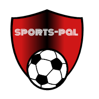

# Sports Pal 

## Getting Started
All in one app to find a pal to play local soccer and to keep up to date with professional games.  

* When you are looking to play a local pick-up game or create one with some friends, this app will let you find friends with similar sports interest.

## Motivation
We wanted to create something that could bring people together over the love of soccer. We wanted this to be a all in one app for your soccer needs. Whenever you need more people to play a pick up game or you want to join a group, Sports Pal has your back! 

## Technologies used
* Css
* jQuery
* Bootstrap CSS framework 
* Handlebars to render HTML
* mySQL2
* Body-parser
* ExpressJS
* NodeJS
* bcrypt Password Authentication
* request for AJAx calls to SportRadar API

## Here's what the App looks like

#### Installation
* NodeJs
* Node Package Modules(NPM) for express, exprees-handlebars, mysql2, Sequelize, body-parser, router

### Authors
* [Mridula](https://github.com/MridulaUdayaShankar)

### Acknowledgements
* Thank you for your constant support, Jerome Chennette, Amber Borroughs, Sasha Patsel, Ricky Feng 
